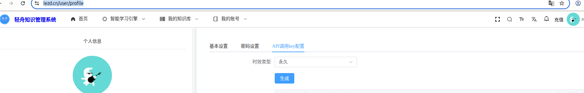
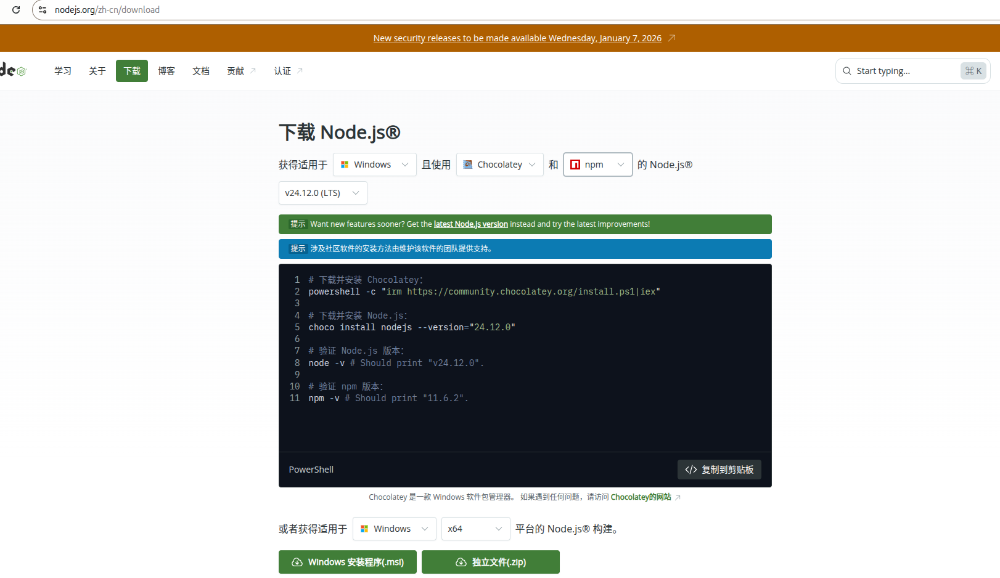
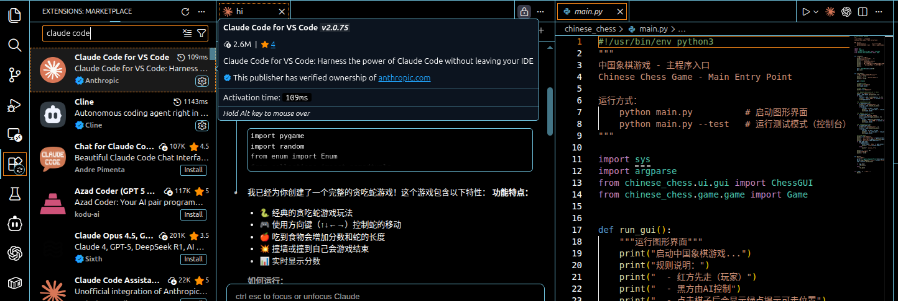
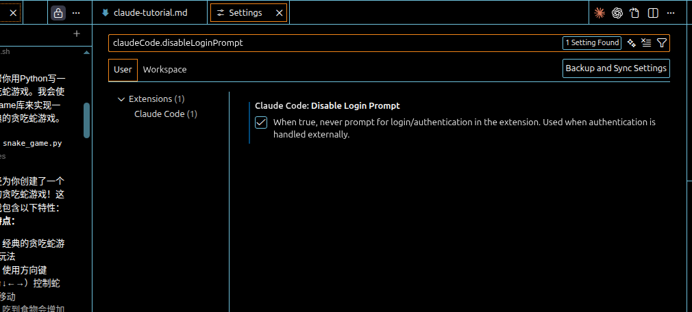
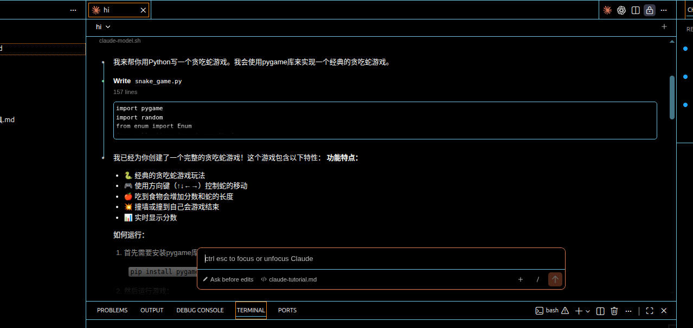
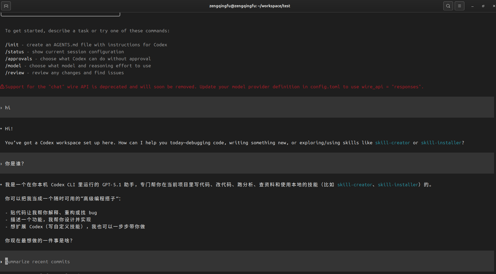

# Claude Code和Codex安装、配置以及使用教程

# 1、获取api-key
1. 登陆https://lezd.cn/user/profile
2. 点击生成api-key


# 2、配置环境变量
## 2.1 Linux(Ubuntu 20.04+/Debian 10+)
将以下环境变量添加到~/.bashrc里面(以下操作步骤在Ubuntu 24.04上验证过)
执行vim ~/.bashrc，在文件的最后，添加以下内容：
```bash
# claude code cli and vscode claude-code extension
export ANTHROPIC_MODEL="claude-sonnet-4-5-20250929"
export ANTHROPIC_SMALL_FAST_MODEL="claude-sonnet-4-5-20250929"
export ANTHROPIC_BASE_URL="https://www.lezd.cn:48080/basic"
export ANTHROPIC_AUTH_TOKEN="your api key"
```
其中claude模型名称可选择下面中的一个：
```
claude-haiku-4-5-20251001
claude-opus-4-1-20250805
claude-opus-4-5-20251101
claude-sonnet-4-5-20250929
```


## 2.2 macOS 10.15+
Mac默认用zsh，如果你的Mac用的其他的shell，请换成其他文件
执行vim ~/.zshrc，在文件的最后，添加以下内容：
```bash
# claude code cli and vscode claude-code extension
export ANTHROPIC_MODEL="claude-sonnet-4-5-20250929"
export ANTHROPIC_SMALL_FAST_MODEL="claude-sonnet-4-5-20250929"
export ANTHROPIC_BASE_URL="https://www.lezd.cn:48080/basic"
export ANTHROPIC_AUTH_TOKEN="your api key"

# for codex cli
export V_API_KEY="your api key"
```

## 2.3 Windows 10+
将获取的api key设置成Windows的环境变量。

需要设置的环境变量：

Claude Code配置：
变量名：ANTHROPIC_BASE_URL
变量值：https://www.lezd.cn:48080/basic
变量名：ANTHROPIC_API_KEY
变量值：你的密钥
变量名：ANTHROPIC_AUTH_TOKEN
变量值：你的密钥

OpenAI Codex配置（可选）：
变量名：OPENAI_BASE_URL
变量值：https://api.code-relay.com/v1
变量名：OPENAI_API_KEY
变量值：你的密钥
变量名：CODEX_API_KEY
变量值：你的密钥

设置方法：
1. 右键"此电脑" → "属性" → "高级系统设置" → "环境变量"
2. 在"系统变量"区域点击"新建"
3. 分别添加上述三个变量
4. 点击"确定"保存所有更改

# 3. 安装Claude Code以及Codex
## 3.1 安装nodejs
### 3.1.1 方法一
参考教程：https://nodejs.org/zh-cn/download/current
```bash
# 下载并安装 nvm：
curl -o- https://raw.githubusercontent.com/nvm-sh/nvm/v0.40.3/install.sh | bash

# 代替重启 shell
\. "$HOME/.nvm/nvm.sh"

# 下载并安装 Node.js：
nvm install 25

# 验证 Node.js 版本：
node -v # Should print "v25.2.1".

# 验证 npm 版本：
npm -v # Should print "11.6.2".
```

### 3.1.2 方法二
```
curl -fsSL https://deb.nodesource.com/setup_22.x | sudo bash -
sudo apt-get install -y nodejs
node --version
npm --version
```

### 3.1.3 方法三 Windows系统下
请访问 https://nodejs.org/zh-cn/download 下载LTS版本（推荐）



在开始菜单搜索 "PowerShell" 或按 Win+X 选择 "Windows PowerShell"，验证以下命令安装情况：
```powershell
node -v
npm -v
```

## 3.2 安装 Claude Code 和 Codex
安装Claude Code
```bash
npm install -g @anthropic-ai/claude-code
claude --version
```
安装Codex
```
npm i -g @openai/codex

# 或在有时需要的原生包名：
# npm i -g @openai/codex@native

codex --version
```

# 4. 在vscode里面安装Claude Code和 Codex 插件
claude code插件安装参考文档：https://code.claude.com/docs/en/vs-code#install-the-extension

## 4.1 安装claude code插件



## 4.2 Disable Claude Code登陆提示



## 4.3 重启vscode(可选。为了加载第2步中配置的环境变量，如果是在配置好环境变量后新启动的vscode，则不必重启）


# 5. Claude Code使用
## 5.1 直接在命令行使用
```bash
claude
```
参考视频：

<video controls src="录屏 2026-01-03 22-04-12.webm" title="Title"></video>


## 5.2 在vscode里面使用


使用Claude Code生成贪吃蛇游戏代码，参考视频：

<video controls src="录屏 2026-01-04 14-34-21.webm" title="Title"></video>

# 6. Codex 使用
!!! Codex 目前只支持在命令行里面使用

## 6.1 配置Codex
codex配置文件config.toml
```bash
mkdir -p ~/.codex
vim ~/.codex/config.toml
```

在config.toml中加入如下配置，根据需求修改：
```bash
model_provider = "vapi"  # 设置API供应商
model = "gpt-5.1"        # 填写支持codex的模型即可
model_reasoning_effort = "low" # 思考级别 low medium（默认） high minimal，不需要可以#注释掉

# 供应商设置
[model_providers.vapi]
name = "VAPI"
base_url = "https://www.lezd.cn:48080/basic/v1"
env_key = "V_API_KEY"    # 保留这个值，不需要替换为apikey
wire_api = "chat" # 使用 /v1/chat/completions 协议
query_params = {}
request_max_retries = 4            # 失败最大重试次数
stream_max_retries = 10            # 流中断后最大重试次数

# 可选：定义一个 profile，便于命令行快速切换
[profiles.vapi]
model_provider = "vapi"
model = "gpt-5.1"
approval_policy = "on-request"      # 需要时再询问是否执行
sandbox_mode = "workspace-write"    # 允许在当前工程写文件，依旧禁网
```

## 6.2 直接在命令行使用
```bash
codex
```

